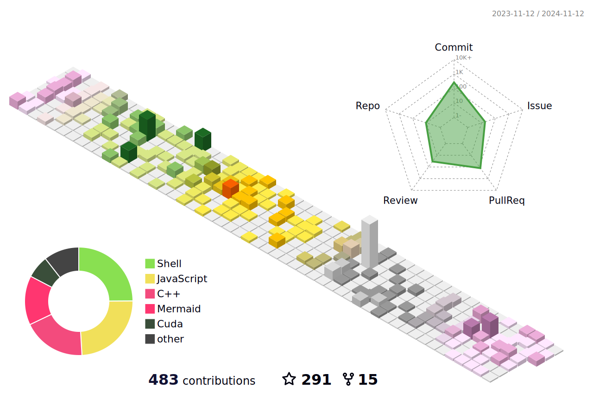

### Hey 👋, I'm lanling   

<!--[  ](https://weibo.com/u/6600574650) -->
<!-- -  Youth begins in 2010 and ends in 2022;-->

<!--   -->

**Tools & Status:**

<code></code>
<code></code>
<code></code>
<code></code>
<code></code>
<code></code>
<code></code>
<code></code>
<code></code>
<code></code>

<table cellspacing="0" cellpadding="0">
  <tr align="center" valign="middle">
    <td></td>
    <td></td>
  </tr>
</table>

<!--
<table cellspacing="0" cellpadding="0">
  <tr align="center" valign="middle">
    <td></td>
  </tr>
</table>
-->

**Alumni or Colleagues**

- :rowboat: 2016-2020, Days at the [North China University of Science and Technology](https://www.ncst.edu.cn/) is the deepest memories in my whole life, my supervisor is [Yan Shaohong](http://lxy.ncst.edu.cn/col/1587717135030/2020/04/26/1587851377899.html), but ... 学生朽木
- :boat: 2020-2023, School of Computer Science and Technology, 
  [XDU](https://cs.xidian.edu.cn/index.htm)
- :speedboat: 2023-now, working at  [XiaoMI](https://hr.xiaomi.com/campus) as a CV algorithm engineer in camera department, responsible for heterogeneous and high-performance computing
  
**Talking about Personal Stuffs:**

- 👨‍💻 I engaged in adversarial samples and continue learning research in my previous school days;
- 🌱 I'm currently interested in neon, opencl, cuda, performance improvement and program architecture, etc;
- 🤔 In terms of technology, I am fluent in python and studying C++ and Vim recently;
- 📝 See my website: [Just for Life](https://muyuuuu.github.io) to get more info.

 

**Please feel free to contact me via lanlingock [AT] gmail [dot] com if you want to do project with me.**
