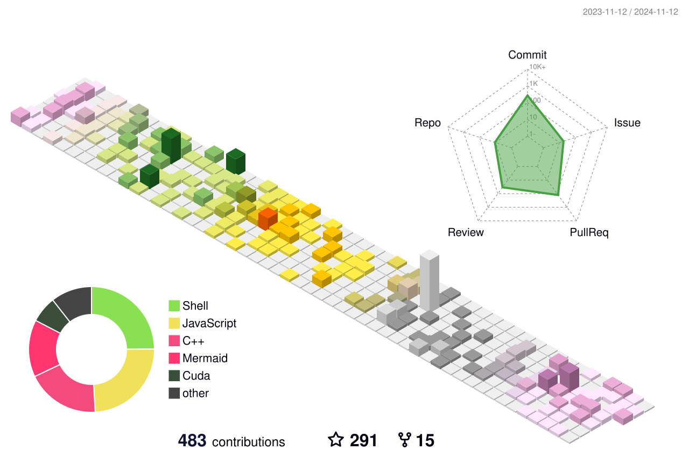

### Hey 👋, I'm lanling   

<!--[  ](https://weibo.com/u/6600574650) -->

**Tools & Status:**

  
  
  
  
  
  
  
  
  
  
  

**Alumni or Colleagues**

- :rowboat: 2016-2020, Days at the [North China University of Science and Technology](https://www.ncst.edu.cn/) is the deepest memories in my whole life, my supervisor is [Yan Shaohong](http://lxy.ncst.edu.cn/col/1587717135030/2020/04/26/1587851377899.html), but ... 学生朽木
- :boat: 2020-2023, School of Computer Science and Technology, 
  [XDU](https://cs.xidian.edu.cn/index.htm)
- :speedboat: 2023.07-2025.07, worked on high-performance computing for  [XiaoMI](https://hr.xiaomi.com/campus) Camera, where I deployed algorithms including portrait mode, facecolor, auto exposure, dehazing, night scene snapshot, and super-resolution to Xiaomi smartphones such as the XiaoMI 14, 15, and 17 series.
- :ship: 2025-future, working at  [Alibaba](https://ali-home.alibaba.com/about-alibaba)(AiCheng), responsible for large-scale distributed training in search, advertising, and recommendation systems, with a primary focus on [RecIS](https://github.com/alibaba/RecIS/blob/main/README_zh.md)

**Talking about Personal Stuffs:**

<table cellspacing="0" cellpadding="0">
    <source media="(prefers-color-scheme: dark)" srcset="https://github-readme-stats-ouuan.vercel.app/api?username=muyuuuu&theme=dark&show_icons=true">
    
</table>

- 👨‍💻 I engaged in adversarial samples and continue learning research in my previous school days;
- 🌱 I'm currently interested in neon, opencl, cuda, performance improvement and program architecture, etc;
- 🤔 In terms of technology, I am fluent in python and studying C++ and Vim recently;
- 📝 See my website: [Just for Life](https://muyuuuu.github.io) to get more info.

 

**Please feel free to contact me via lanlingock [AT] gmail [dot] com if you want to do project with me.**
